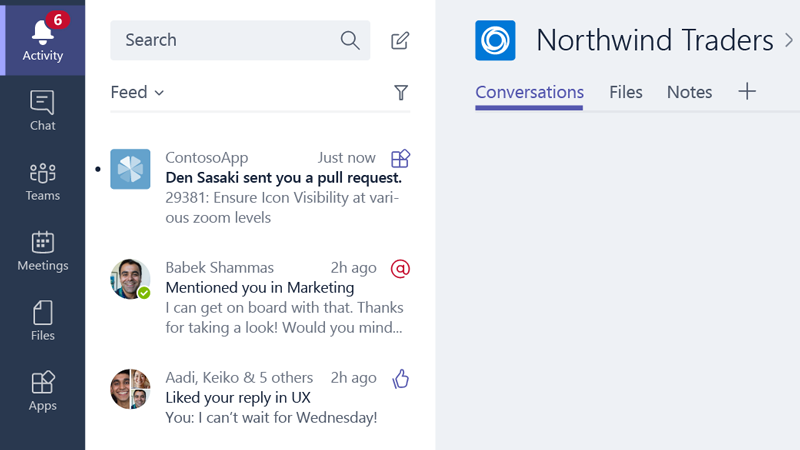

# Notifying your users through the activity feed

>Note: activity feed support is available in [Public Developer Preview](publicpreview.md) only.  Additionally, many features in this document are under construction, and as such, subject to change.


The activity feed in Microsoft Teams is the user's single inbox for all activity across Teams.  The feed aggregates important content from:
* Teams/channels
* Chats
* Apps such as Files, Planner and your Teams app

If your app posts cards and other messages into a channel, they'll automatically show up in the user's feed if he or she has followed that channel.

>Note: the features mentioned below are coming soon to Developer Preview

Additionally, you can also send personal (1:1 chat) messages into the feed as preview cards summarizing your app's activity.  You can construct the message such that clicking on the card navigates the user straight to the message or object that triggered the notification, such as an entity in a tab.  This allows the user to see the full content of the activity.

## Sending content to the activity feed

Activity feed notification leverages your existing integration with the Bot Framework APIs.  You can flag specific messages to generate notifications which appear in the activity ffeed. This allows generating higher levels of engagement by creating alerts on web/desktop and mobile apps.

When constructing your message, the following fields should be populated so that the correct preview content can be shown in the feed:
* `message.text`, which shows up as the activity title
* `message.summary`, which shows up as the activity preview



In addition to simply appearing in the feed, your app can also encode a deep link URL to an entity, such as your app’s tab. This drives user engagement to your app’s tab by allowing one-click navigation to that tab’s content.

#### REST API sample

For a message to be eligible to be included in the feed, simply mark an existing bot message with a special property, which indicates it should generate a notification:

```json
"channelData": {
  "notification": {
    "alert": true
  }
}
```

Here is a full request example:
```json
POST /v3/conversations/a%3A1pL6i0oY3C0K8oAj8/activities/1493070356924
{
  "type": "message",
  "timestamp": "2017-04-24T21:46:00.9663655Z",
  "serviceUrl": "https://callback.com",
  "channelId": "msteams",
  "from": {
    "id": "28:e4fda94a-4b80-40eb-9bf0-6314491bc793",
    "name": "The bot"
  },
  "conversation": {
    "id": "a:1pL6i0oY3C0K8oAj8"
  },
  "recipient": {
    "id": "29:1rsVJmSSFMScF0YFyCXpvNWlo",
    "name": "User"
  },
  "text": "John Phillips assigned you a weekly todo",
  "summary": "Don't forget to meet with Marketing next week",
  "channelData": {
    "notification": {
      "alert": true
    }
  },
  "replyToId": "1493070356924"
}
```

#### .NET SDK sample

>Coming soon!

#### Node SDK sample

>Coming soon!


## Deep linking

To navigate the user to content within your tab, your message must include an attachment with a tap action. This tap action should be of type `OpenUrl` and have a value that follows the [Microsoft Teams deep linking format](deeplinks.md).

>Note: if the deep link does not follow the Teams format, then clicking on the notification in the Feed will navigate the user first to the chat with the bot. From there, the user can engage the attachment’s tap action to navigate to an external website.


