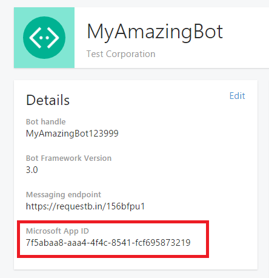

# Adding and removing bots 

Add your bot to Microsoft Teams to test functionality.  Note that during Preview, end users must follow the side-load process below to use your bots.  A future Bots Gallery will allow new users to discover approved and published bots for Microsoft Teams.

> **During Preview, your tentant administrator will need to enable side-loading of bots for your organization. [Here's how](setup.md).**

## Adding a bot for 1:1 chat

There are two ways to test your bot in Microsoft Teams:

*	On the [Bot Dashboard](https://dev.botframework.com/bots) page for your bot, under **Channels**, select **Add to Microsoft Teams**.

	Microsoft Teams will launch with a 1:1 chat with your bot.

*	Side-load your bot from within Microsoft Teams:
	* On the [Bot Dashboard](https://dev.botframework.com/bots) page for your bot, under **Details**, copy the **Microsoft App ID** for your bot.
	
	
	
	* From within Microsoft Teams, on the **Chat** pane, select the **Add chat** icon. For **To:**, paste your bot's Microsoft app ID.
	
	
		
		The app ID should resolve to your bot name.
	* Select your bot and send a message to initiate a conversation.
	* Alternatively, you can paste your bot's app ID in the search box in the top left in Microsoft Teams. In the search results page, navigate to the People tab to see your bot and to start chatting with it. 

## Adding a bot as a Team member - (bots in channels)

1.	To start, navigate to the Team, click on the overflow, and select “Add members”

 

2.	Paste in your bot’s ID, which will resolve the profile of the Bot
3.	Click Done. This will now add the bot as a member of the team.
4.	You can start by invoking your bot by @mentioning the name of the bot, which should autocomplete.

### Disabling a bot

To stop your bot receiving messages and remove it from directories go to your Bot Dashboard and edit the Microsoft Teams channel. Disable the bot in settings.  Note that this will not remove the bot from other users' Teams instance.  

### Removing a bot

To remove your bot completely from Team use, go to your Bot Dashboard and edit the Microsoft Teams channel. Select the **Delete** button at the bottom.  Note that this will not remove the bot from other users' Teams instance.  

 
