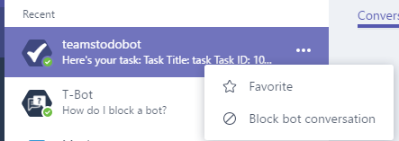

# Testing your bot

To test your bot in Microsoft Teams, you must follow one of the side-loading processes enumerated here.  Note that each method triggers a slightly different flow, and enables bots in different contexts as explained below.

For published bots, end users will be able to access via the discover apps gallery accessable via the Discover Bots access points in the product.

> **Note: your tenant administrator will need to enable side-loading of bots for your organization. [Here's how](setup.md).**

## Adding a bot to a team for use in channels

To add a bot to a team, so it is usable in the team channel by all team members, you must [create an app package](createpackage.md) and [sideload it](sideload.md) to the appropriate team.  This process makes the bot available in all channels within the team (when @mentioned) as well as for all team members in 1:1 context.  Please note that the bot will not be available in other teams without being explicitly added to them.

When a bot is first added via the above method, Teams will send the `conversationUpdate` event.  The payload for this event will contain a `channelData` object with the team information.  For more information about bot events, see the documentation [here](botevents.md).

## Adding a bot for 1:1 chat only

If your bot only needs to be accessed in 1:1, not made available for channel conversations, you can directly sideload your bot for that purpose.  

There are two ways to test load your bot for 1:1 conversations in Microsoft Teams:

1.	On the [Bot Dashboard](https://dev.botframework.com/bots) page for your bot, under **Channels**, select **Add to Microsoft Teams**.

	Microsoft Teams will launch with a 1:1 chat with your bot.

2. 	Directly reference your bot's app ID from within Microsoft Teams:
	* On the [Bot Dashboard](https://dev.botframework.com/bots) page for your bot, under **Details**, copy the **Microsoft App ID** for your bot.
	
	
	
	* From within Microsoft Teams, on the **Chat** pane, select the **Add chat** icon. For **To:**, paste your bot's Microsoft app ID.
	
	
		
		The app ID should resolve to your bot name.
	* Select your bot and send a message to initiate a conversation.
	* Alternatively, you can paste your bot's app ID in the search box in the top left in Microsoft Teams. In the search results page, navigate to the People tab to see your bot and to start chatting with it. 

When a bot has been added via the above, it will not be addressable in channel conversations.

As with bots added to a team, your bot will receive the `conversationUpdate` event, but without the team information in the `channelData` object.

## Blocking a bot in 1:1 chat

Note that users may choose to block your bot from sending 1:1 messages.  They may toggle this by right-click on your bot in the chat channel and select "Block..." or "Unblock bot conversation." This means your bots will continue to send messages but the user will not receive those messages.

## Removing a bot from a team

Users may delete the bot by clicking the trashcan on the Bots list in their teams view.  Note that this only removes the bot from that team's use - individual users will still be able to interact in 1:1 context.

Bots in 1:1 cannot be disabled or removed by a user, short of completely removing the bot from Teams use.  See below for more.

## Disabling a bot in Teams

To stop your bot receiving messages go to your Bot Dashboard and edit the Microsoft Teams channel.  Unselect the "Enable on Microsoft Teams" option.  This will prevent users from interacting with the bot, but it will still be discoverable and users will still be able to add it to teams via the methods above. 

## Removing a bot from Teams

To remove your bot completely from Team use, go to your Bot Dashboard and edit the Microsoft Teams channel. Select the **Delete** button at the bottom.  This will prevent users from discovering, adding, or interacting with your bot.  Note that this will not remove the bot from other users' Teams instance, although it will cease functioning for them as well.

## Removing your bot from the Office Store

If you wish to remove your bot from your Teams app in the Office Store, you must remove the bot from your app manifest and resubmit your app for validation.  See [Submission](submission.md) guidelines for more information.

 
