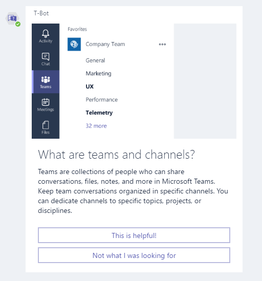
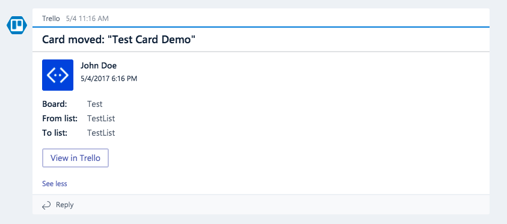
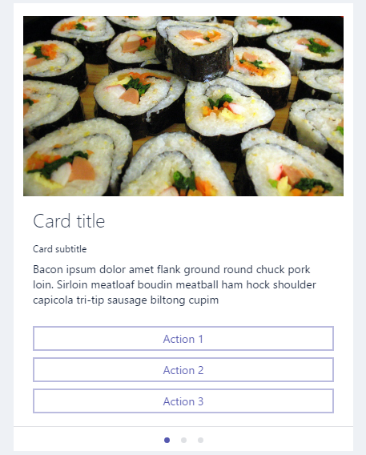

# Activities, Cards and Actions

A conversation is a series of messages sent between your bot and one or more users. Each message is an `Activity` object. When a user sends a message, the channel that they're communicating on posts the message to your bot (web service). Your bot examines the message to determine its type and responds accordingly. 

Most content sent between a user and your bot uses `messageType: message`.  For event-style messages, please review [Microsoft Teams bot events](botevents.md).

For more information about core messaging functionality of the Bot Framework, please review the [documentation](https://docs.botframework.com/en-us/core-concepts/messages/#navtitle) and see BotBuilder samples [here](https://github.com/Microsoft/BotBuilder-Samples/tree/master/Node/cards-RichCards).

> **Note:** Botbuilder has a good repository of card samples: [Node](https://github.com/Microsoft/BotBuilder-Samples/tree/master/Node/cards-RichCards), [C#](https://github.com/Microsoft/BotBuilder-Samples/tree/master/CSharp/cards-RichCards)

# Messages
Most messages to and from your bot are of type `message`.  Your bot can send rich text, pictures and cards. Users can send rich text and pictures to your bot. You can specify the type of content your bot can handle in the Microsoft Teams settings page for your bot.

| Format | From user to bot  | From bot to user |  Notes |                                                           
|:-------|:-------|:------------|:-------|
| Rich text | ✔ | ✔ |  |  
| Pictures | ✔ | ✔ | PNG, JPEG or GIF up to 20Mb |
| Cards | ✘ | ✔ | Teams currently support Hero and Thumbnail cards  |
| Emojis | ✘ | ✔ | Teams currently supports emojis via UTF-16 (e.g. U+1F600 for grinning face)  |

## Message format
You can set the optional [TextFormat](https://docs.botframework.com/en-us/csharp/builder/sdkreference/activities.html) property to control how your message's text content will be rendered.

Microsoft Teams supports the following formatting options:

| TextFormat Value | Description |
|:----------------------|:------------------|
| plain | The text should be treated as raw text with no formatting applied at all |
| markdown | The text should be treated as markdown formatting and rendered on the channel as appropriate |
| xml | The text is simple XML markup (subset of HTML - see link above) |

> **Note:** On hero and thumbnail cards, message format is only supported on the text property. Formatting is not supported on the title and subtitle properties at this time.

## Picture messages

Pictures are sent by adding attachments to a message.  You can find more information on attachments in the [Bot Framework documentation.](https://docs.botframework.com/en-us/core-concepts/attachments/) 

Pictures can be PNG, JPEG or GIF up to 20Mb.

## Cards 

Microsoft Teams supports the following cards which may have several properties and attachments. You can find information on how to use cards in the [.NET SDK](https://docs.botframework.com/en-us/csharp/builder/sdkreference/attachments.html#richcards) and [Node.js SDK](https://docs.botframework.com/en-us/node/builder/guides/examples/#demo-skype-calling) docs.

* Hero card
* Thumbnail card
* O365Connector card

Supported with modifications:
* Signin card - the `signin` action is not supported.  You can replace the button action with `openUrl` to get the desired result.

Not supported:
* Receipt card
* Media cards (Animation, Audio, Video)

Additionally, we support the following layouts:
* Horizontal carousel layout
* Vertical list layout

Both layouts support hero and thumbnail cards.

### Inline card images

Your card can contain inline images by including a link to the image content hosted on a public CDN.

Images are scaled up or down in size while maintaining the aspect ratio to cover the image area, and then cropped from center to achieve the image aspect ratio for the card.

Images must be at most 1024x1024 and 1MB in size, and in either PNG or JPEG format.

| Property | Type  | Description |                                                           
|:-------|:-------|:------------|
| url | URL | HTTPS URL to the image |
| alt | String | Accessible description of the image |


### Hero card

The [hero card](https://docs.botframework.com/en-us/csharp/builder/sdkreference/attachments.html#herocard) renders a title, subtitle, text, large image and buttons.



| Property | Type  | Description |                                                           
|:-------|:-------|:------------|
| title | Rich text | Title of the card. Maximum 2 lines |
| subtitle | Rich text | Subtitle of the card. Maximum 2 lines |
| text | Rich text | Text appears just below the subtitle |
| images: [] | Array of images | Image displayed at top of card. Aspect ratio 16:9 |
| buttons: [] | Array of action objects | Set of actions applicable to the current card. Maximum 6. |
| tap | Action object | This action will be activated when the user taps on the card itself |

### Thumbnail card

The [thumbnail card](https://docs.botframework.com/en-us/csharp/builder/sdkreference/attachments.html#thumbnailcard) renders a title, subtitle, text, small thumbmail image and buttons.


| Property | Type  | Description |                                                           
|:-------|:-------|:------------|
| title | Rich text | Title of the card. Maximum 2 lines |
| subtitle | Rich text | Subtitle of the card. Maximum 2 lines |
| text | Rich text | Text appears just below the subtitle |
| images: [] | Array of images | Image displayed at top of card. Aspect ratio 1:1 (square) |
| buttons: [] | Array of action objects | Set of actions applicable to the current card. Maximum 6. |
| tap | Action object | This action will be activated when the user taps on the card itself |

### O365Connector card

The O365Connector card provides a more flexible layout with multiple sections, images, and fields.



Please review the documentation [here](https://docs.microsoft.com/en-us/outlook/actionable-messages/card-reference) for details about all the supported properties.

You may utilize the O365ConnectorCard class in BotBuilder-MicrosoftTeams SDK ([.NET](https://www.nuget.org/packages/Microsoft.Bot.Connector.Teams)/[Node](https://www.npmjs.com/package/botbuilder-teams)) to send this card from your bot.

### Carousel layout

The [carousel layout](https://docs.botframework.com/en-us/csharp/builder/sdkreference/activities.html) can be used to show a carousel of cards, with associated action buttons.



Properties are the same as for the hero or thumbnail card.

### List layout

The list layout can be used to show a vertically stacked list of cards.


Properties are the same as for the hero or thumbnail card.

> **Note:** Some combinations of list cards may not be supported yet on iOS and Android.

## Buttons

Buttons are shown stacked at the bottom of the card. Button text is always on a single line and will be truncated if the text exceeds the button width. Any additional buttons beyond the maximum number supported by the card will not be shown.

## Card Actions in Teams

Teams supports the following [`CardAction`](https://docs.microsoft.com/en-us/bot-framework/dotnet/bot-builder-dotnet-add-rich-card-attachments#process-events-within-rich-cards) Types:
| CardAction.Type | CardAction.Value | 
| --- | --- |
| `openUrl` | URL to be opened in the built-in browser |
| `imBack `| Text of the message to send to the bot (from the user who clicked the button or tapped the card). This message (from user to bot) will be visible to all conversation participants. |
| `invoke` | Payload of message to send to the bot (from the user who clicked the button or tapped the card).  This message will not be visible. |

>Note: Teams does not support `postBack`, `signin` or other CardActions.

### Action - openUrl

This action type specifies a URL to launch, in the default browser.  Note that your bot does not receive any notice on which button was clicked.

The `value` field must contain a full and properly formed URL.

```json
{
    "type": "openUrl",
    "title": "Tabs in Teams",
    "value": "https://msdn.microsoft.com/en-us/microsoft-teams/tabs"
}
```

### Action - imBack

This action triggers a return message to your bot, as if the user typed it in a normal chat message.  Thus, your user, and all other users if in a channel, will see that button response.

The `value` field should contain the text string echoed in the chat and therefore sent back to the bot.  This is the message text you will process in your bot to perform the desired logic.  Note: this field is a simple string - there is no support for formatting or hidden characters.

> **Note:** imBack is not recommended for bots in channels as the button click will notify each thread participant each time.  Please see `invoke` below for the preferred solution.

```json
{
    "type": "imBack",
    "title": "More",
    "value": "Show me more"
}
```

### Action - invoke

>New: the `invoke` action now sends the user `name` and `channelData` information, if applicable, as part of the payload.

The `invoke` message type silently sends a JSON payload that you define to your bot.  This is useful if you want to send more detailed information back to your bot without having to send via a simple `imBack` text string.  Note that the user, in 1:1 or in channel, sees no notification as a result of their click.

The `value` field will contain a stringified JSON object.  You can include identifiers or any other context necessary to carry out the operation.

```json
{
    "type": "invoke",
    "title": "Option 1",
    "value": { 
        "option": "opt1" 
    } 
}
```

When a user clicks the button, your bot will receive the predefined `value` object with some additional info. Please note, the activity type will be `invoke` instead of `message` (activity.Type == "invoke").

#### Example - Invoke button definition (.NET SDK)
```csharp
var button = new CardAction()
{
    Title = "some button caption",
    Type = "invoke",
    Value = anyObject
};
```

#### Invoke inbound schema example
```json
{
    "type": "invoke",
    "value": {
        "option": "opt1"
    },
    "timestamp": "2017-02-10T04:11:19.614Z",
    "id": "f:6894910862892785420",
    "channelId": "msteams",
    "serviceUrl": "https://smba.trafficmanager.net/amer-client-ss.msg/",
    "from": {
        "id": "29:1Eniglq0-uVL83xNB9GU6w_G5a4SZF0gcJLprZzhtEbel21G_5h-
    NgoprRw45mP0AXUIZVeqrsIHSYV4ntgfVJQ",
        "name": "Richard Moe"
    },
    "conversation": {
        "id": "19:97b1ec61-45bf-453c-9059-6e8984e0cef4_8d88f59b-ae61-4300-bec0-caace7d28446@unq.gbl.spaces"
    },
    "recipient": {
        "id": "28:8d88f59b-ae61-4300-bec0-caace7d28446",
        "name": "MyBot"
    },
    "entities": [
        {
            "locale": "en-US",
            "country": "US",
            "platform": "Web",
            "type": "clientInfo"
        }
    ],
    "channelData": {
        "channel": { 
            "id": "19:dc5ba12695be4eb7bf457cad6b4709eb@thread.skype" 
        },
        "team": { 
            "id": "19:712c61d0ef384e5fa681ba90ca943398@thread.skype" 
        },
        "tenant": { 
            "id": "72f988bf-86f1-41af-91ab-2d7cd011db47" 
        }
    }
}
```
