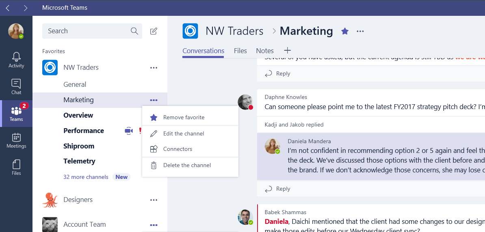
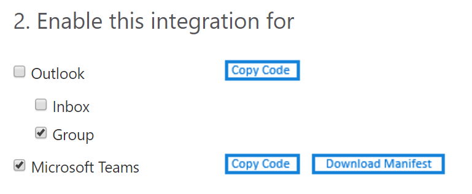
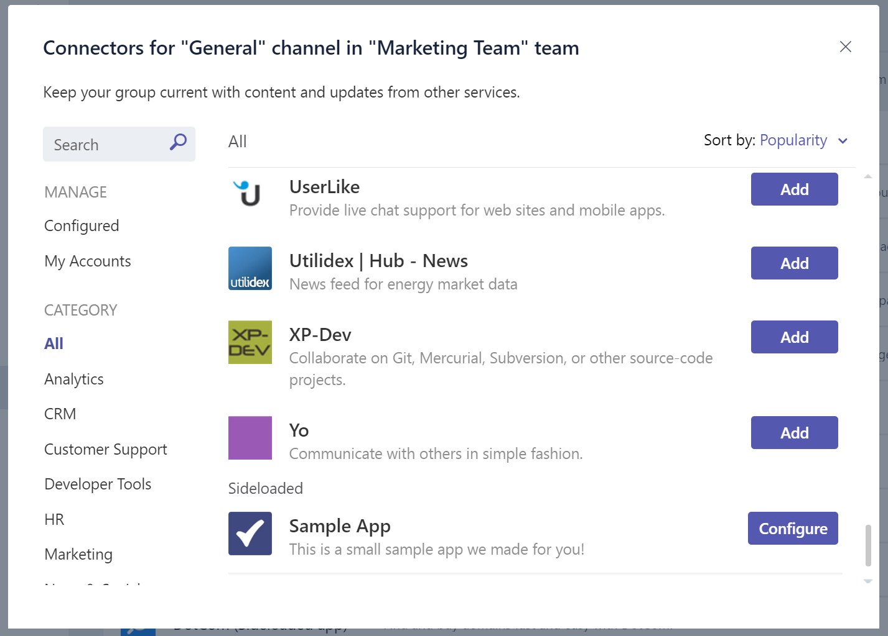

# Getting started with Connectors for Microsoft Teams

Office 365 Connectors are a great way to push your app's rich content into Microsoft Teams. Any user can connect their team to services like Trello, GitHub, Bing News, Twitter, etc., and get notified of the team's activity in that service. From tracking a team's progress in Trello, to following important hashtags in Twitter, Office 365 Connectors make it easier for your team to stay in sync and get more done. You can even add rich actions to your content so that users can complete tasks right within the channel.

>**New**
With Microsoft Teams app, you can add your existing Office 365 Connector or build a new one to include in Microsoft Teams.  See [Build your own Connector](https://dev.outlook.com/Connectors/ConnectButton) for more information.

## Accessing Office 365 Connectors from Microsoft Teams

From within Microsoft Teams, click  **...** next to the channel name in the list of channels and then select **Connectors**.



And then select a connector from the list and select **Add**:


# Creating messages through Office 365 Connectors

There are two options for posting messages via Connectors:
1. Set up a simple custom incoming webhook integration if you want an integration just for your team.
2. Register a Connector and submit it as a Microsoft Teams app if you want others to it.

Both options involve posting a simple JSON payload to an HTTP webhook to create the [Connector message](https://dev.outlook.com/Actions/getting-started) within Microsoft Teams. You can also use the markup to include rich actions, such as text entry, multi-select, or picking a date and time. The code that generates the card and posts to the incoming webhook API can be running on any hosted service.

#### Example connector message
```json
{
    "@type": "MessageCard",
    "@context": "http://schema.org/extensions",
    "themeColor": "0076D7",
    "summary": "Larry Bryant created a new task",
    "sections": [{
        "activityTitle": "Larry Bryant created a new task",
        "activitySubtitle": "On Project Tango",
        "activityImage": "https://teamsnodesample.azurewebsites.net/static/img/image5.png",
        "facts": [{
            "name": "Assigned to",
            "value": "Unassigned"
        }, {
            "name": "Due date",
            "value": "Mon May 01 2017 17:07:18 GMT-0700 (Pacific Daylight Time)"
        }, {
            "name": "Status",
            "value": "Not started"
        }],
        "markdown": true
    }],
    "potentialAction": [{
        "@type": "ActionCard",
        "name": "Add a comment",
        "inputs": [{
            "@type": "TextInput",
            "id": "comment",
            "isMultiline": false,
            "title": "Add a comment here for this task"
        }],
        "actions": [{
            "@type": "HttpPOST",
            "name": "Add comment",
            "target": "http://..."
        }]
    }, {
        "@type": "ActionCard",
        "name": "Set due date",
        "inputs": [{
            "@type": "DateInput",
            "id": "dueDate",
            "title": "Enter a due date for this task"
        }],
        "actions": [{
            "@type": "HttpPOST",
            "name": "Save",
            "target": "http://..."
        }]
    }, {
        "@type": "ActionCard",
        "name": "Change status",
        "inputs": [{
            "@type": "MultichoiceInput",
            "id": "list",
            "title": "Select a status",
            "isMultiSelect": "false",
            "choices": [{
                "display": "In Progress",
                "value": "1"
            }, {
                "display": "Active",
                "value": "2"
            }, {
                "display": "Closed",
                "value": "3"
            }]
        }],
        "actions": [{
            "@type": "HttpPOST",
            "name": "Save",
            "target": "http://..."
        }]
    }]
}
```

This produces the following card in the channel.


For full details on the available options on cards, see [Office 365 Connectors API Reference](https://dev.outlook.com/Connectors/Reference).

## Setting up a custom incoming webhook

Follow the steps below to see how to send a simple card to a Connector.

1. From within Microsoft Teams, click **...** next to the channel name and then select **Connectors**.
2. Scroll through the list of connectors to **Incoming Webhook**, and click **Add**.
3. Enter a name for the webhook, upload an image to associate with data from the webhook, and select **Create**.
4. Copy the webhook to the clipboard and save it. You'll need the webhook URL for sending information to Microsoft Teams.
5. Click **Done**.

### Post a message to the webhook

For this part of the exercise, you'll need [cURL](https://curl.haxx.se/). It's assumed that you have this installed and are familiar with basic usage.

1.	From the command line, enter the following cURL command:

	`curl -H "Content-Type: application/json" -d "{\"text\": \"Hello World!\"}" <YOUR WEBHOOK URL>`

2.	If the POST succeeds, you should see a simple 1 output by cURL.

3.	Check the Microsoft Team. You should see the new card posted to the team.

## Registering your connector

With Microsoft Teams apps, you can distribute your registered Connector as part of your app package.  Whether as a standalone solution, or one of several [capabilities](index.md) your experience enables in Teams, you can [package](createpackage.md) and [submit](submission.md) your Connector as part of your Store submission, or provide to users directly for sideload within teams.

To distribute your Connector, you'll first need to register using the [Connector Developer Portal](https://go.microsoft.com/fwlink/?LinkID=780623). To have your connector work in Microsoft Teams, you will need to check the box under **Enable this integration for**.

You can download the auto-generated Teams app manifest from the portal. This manifest.json file contains the basic elements needed to test and submit your app.



#### Example manifest.json with connector (replace connectorId with your connector's GUID)
```json
{
  "$schema": "https://statics.teams.microsoft.com/sdk/v1.0/manifest/MicrosoftTeams.schema.json",
  "manifestVersion": "1.0",
  "id": "e9343a03-0a5e-4c1f-95a8-263a565505a5",
  "version": "1.0",
  "packageName": "com.sampleapp",
  "developer": {
    "name": "Publisher",
    "websiteUrl": "https://www.microsoft.com",
    "privacyUrl": "https://www.microsoft.com",
    "termsOfUseUrl": "https://www.microsoft.com"
  },
  "description": {
    "full": "This is a small sample app we made for you! This app has samples of all capabilities MS Teams supports.",
    "short": "This is a small sample app we made for you!"
  },
  "icons": {
    "outline": "https://outlook.office.com/connectors/Content/Images/IncomingWebhook.jpg",
    "color": "https://outlook.office.com/connectors/Content/Images/IncomingWebhook.jpg"
  },
  "connectors": [
    {
      "connectorId": "e9343a03-0a5e-4c1f-95a8-263a565505a5",
      "scopes": [
        "team"
      ]
    }
  ],
  "name": {
    "short": "Sample App",
    "full": "Sample App"
  },
  "accentColor": "#FFFFFF",
  "needsIdentity": "true"
}
```

## Testing your Connector

To test your Connector, side load it to a team as you normally would with any other app. You can create a .zip package using the manifest file from the Connector developer portal.

Once you've side loaded the app, open the Connector dialog from any channel. Scroll to the bottom to see your app now under the **Sideloaded** section.



You can now launch the configuration experience. In Microsoft Teams, this flow will take place entirely within the product through a popup window.

## Publishing your app

>Note: Currently, we do not support users configuring your connector externally via the "Connect to O365" button. End users will need to visit Teams first in order to add a connector.

Once your app is ready for submission, follow the same process for submitting your app to the [Office Store](https://msdn.microsoft.com/en-us/microsoft-teams/submission).