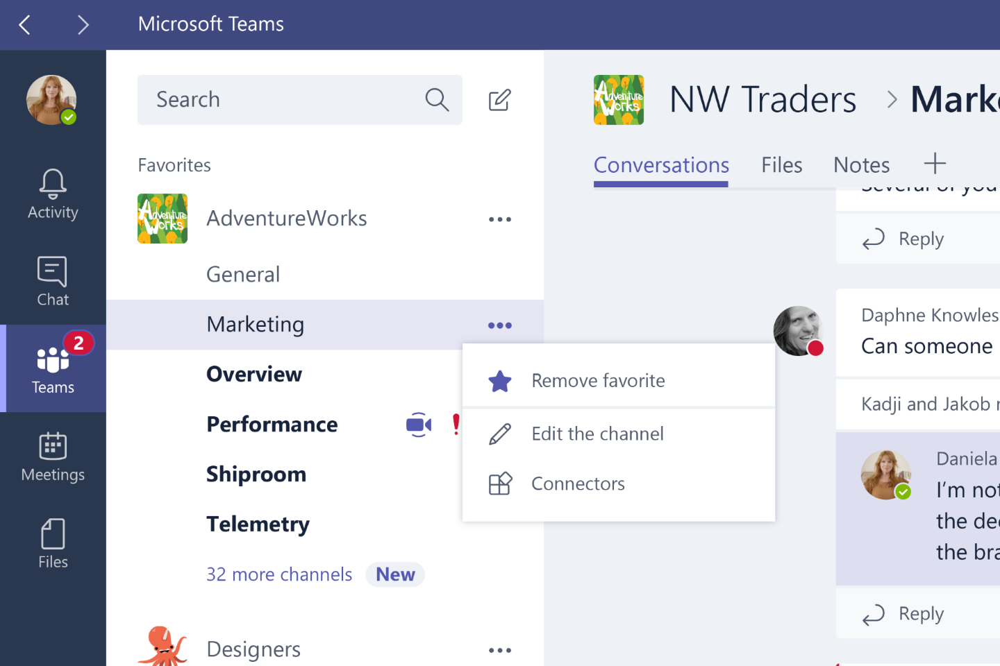

# Getting started with Office 365 Connectors for Microsoft Teams (Preview)

Office 365 Connectors are a great way to get useful information and content into Microsoft Teams. Any user can connect their group to services like Trello, GitHub, Bing News, Twitter, etc., and get notified of the team's activity in that service. From tracking a team's progress in Trello, to following important hashtags in Twitter, Office 365 Connectors make it easier for your team to stay in sync and get more done.

Office 365 Connectors also provide a way for developers to integrate with Microsoft Teams by building custom incoming webhooks Connectors to generate rich cards.

> **Don't have Microsoft Teams? Get a one-year trial at no charge** To get started developing for Microsoft Teams, you'll need an Office 365 account, and to turn on Teams for your organization. [Here's how](setup.md).

>**Note:** Currently, Microsoft Teams does not support registering and building an Office 365 Connector and adding a **Connect to Office 365** button to your app. 

## Accessing Office 365 Connectors from Microsoft Teams

From within a Microsoft Teams channel, select **... (more options)** next to the channel name and then select **Connectors**.

And then select a connector from the list and select **Add**:

## Creating messages through Office 365 Connectors with Microsoft Teams

Office 365 Connectors use webhooks to create Connector Card messages within Microsoft Teams. Developers can create these cards by sending an HTTP request with a simple JSON payload to a Microsoft Teams webhook address. 

### Create the webhook

Follow the steps below to see how to send a simple card to a connector.

1. From within a Microsoft Teams channel, select **...(more options)** next to the channel name and then select **Connectors**.
2. Scroll through the list of connectors to **Incoming Webhook**, and click **Add**.
3. Enter a name for the webhook, upload an image to associate with data from the webhook, and select **Create**.
4. Copy the webhook to the clipboard and save it. You'll need the webhook URL for sending information to Microsoft Teams.
5. Click **Done**.

### Post a simple message to the webhook

For this part of the exercise, you'll need [cURL](https://curl.haxx.se/). It's assumed that you have this installed and are familiar with basic usage.

1.	From the command line, enter the following cURL command:

	`curl -H "Content-Type: application/json" -d "{\"text\": \"Hello World!\"}" <YOUR WEBHOOK URL>`

2.	If the POST succeeds, you should see a simple 1 output by cURL.

3.	Check the Microsoft Team. You should see the new card posted to the team.

## Next steps

To see how to send more complex messages, see **Posting more complex cards** in [Get started with Office 365 Connector Cards](https://dev.outlook.com/Connectors/GetStarted).

For full details on the available options on cards, see [Office 365 Connectors API Reference](https://dev.outlook.com/Connectors/Reference).

We do not yet support registering your Office 365 Connector in the [Connectors Developer Dashboard Beta](https://dev.outlook.com/Connectors/ConnectButton).

