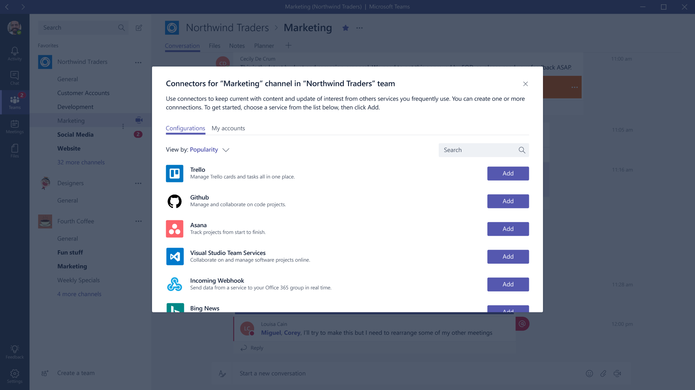

# Getting started with Connectors for Microsoft Teams

Office 365 Connectors are a great way to get useful information and content into Microsoft Teams. Any user can connect their team to services like Trello, GitHub, Bing News, Twitter, etc., and get notified of the team's activity in that service. From tracking a team's progress in Trello, to following important hashtags in Twitter, Office 365 Connectors make it easier for your team to stay in sync and get more done.

Office 365 Connectors also provide a way for developers to integrate with Microsoft Teams by building custom incoming webhooks Connectors to generate rich cards within channels.

>**New**
With Microsoft Teams app, you can add your existing Office 365 Connector or build a new one to include in Microsoft Teams.  See [Build your own Connector](https://dev.outlook.com/Connectors/ConnectButton) for more information.

## Accessing Office 365 Connectors from Microsoft Teams

From within Microsoft Teams, click  **...** next to the channel name in the list of channels and then select **Connectors**.


And then select a connector from the list and select **Add**:



# Creating messages through Office 365 Connectors with Microsoft Teams

Office 365 Connectors use webhooks to create Connector Card messages, including the new [Actionable Message card type](https://dev.outlook.com/Actions/getting-started), within Microsoft Teams. Developers can create these cards by sending an HTTP request with a simple JSON payload to a Microsoft Teams webhook address. 


## Create a simple Connector webhook

Follow the steps below to see how to send a simple card to a connector.

1. From within Microsoft Teams, click **...** next to the channel name and then select **Connectors**.
2. Scroll through the list of connectors to **Incoming Webhook**, and click **Add**.
3. Enter a name for the webhook, upload an image to associate with data from the webhook, and select **Create**.
4. Copy the webhook to the clipboard and save it. You'll need the webhook URL for sending information to Microsoft Teams.
5. Click **Done**.

### Post a simple message to the webhook

For this part of the exercise, you'll need [cURL](https://curl.haxx.se/). It's assumed that you have this installed and are familiar with basic usage.

1.	From the command line, enter the following cURL command:

	`curl -H "Content-Type: application/json" -d "{\"text\": \"Hello World!\"}" <YOUR WEBHOOK URL>`

2.	If the POST succeeds, you should see a simple 1 output by cURL.

3.	Check the Microsoft Team. You should see the new card posted to the team.

## Next steps

For full details on the available options on cards, see [Office 365 Connectors API Reference](https://dev.outlook.com/Connectors/Reference).

# Publish your Connector

With Microsoft Teams apps, you can distribute your [Connector Developer Portal](https://go.microsoft.com/fwlink/?LinkID=780623) registered Connector as part of your app package.  Whether as a standalone solution, or one of several [capabilities](index.md) your experience enables in Teams, you can [package](createpackage.md) and [submit](submission.md) your Connector as part of your Store submission, or provide to users directly for sideload within teams.

To add your Connector as part of your Teams app package, include the `connector` block in your manifest.json file:
```json
"connectors": [
  {
    "connectorId": "GUID-FROM-CONNECTOR-DEV-PORTAL%",
    "scopes": [ "team"]
  }
]
```

Like other `scopes`, you can choose to make your Connector available in `team` (channel) or `personal` context.

