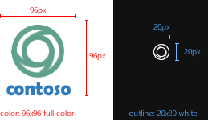
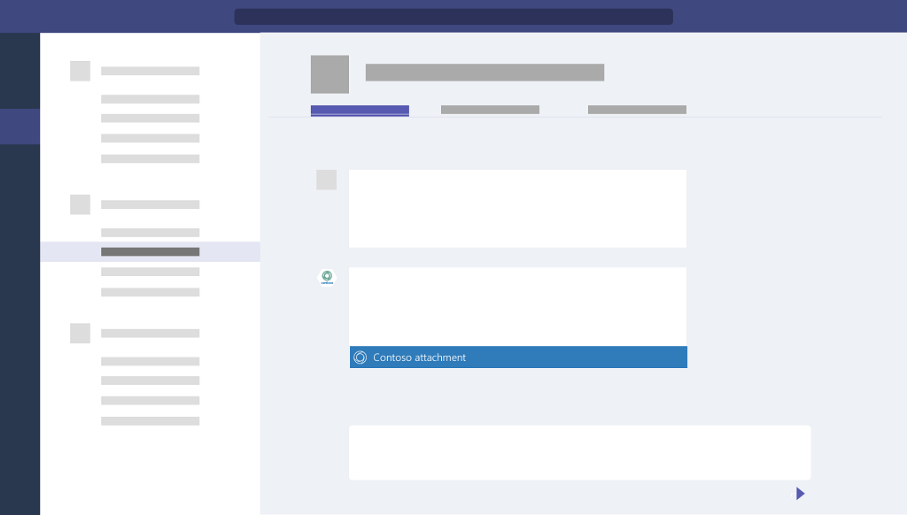
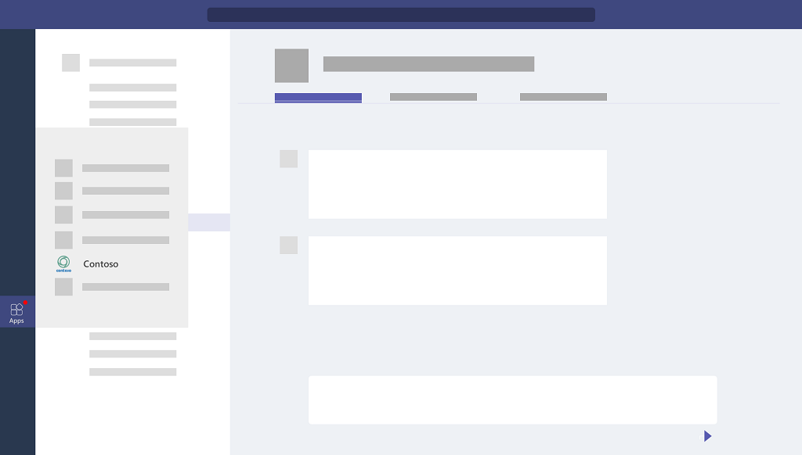
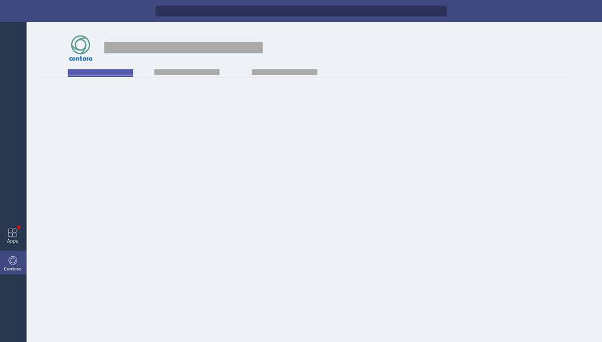

# Create the package for your Microsoft Teams app

App experiences in Teams are defined by their app manifest, and bundled in an app package for use in sideloading or Store submission.  You'll need an app package to test your experience in Teams, via the sideloading process documented [here](sideload.md).

A Teams app package is a zip file containing:
* A manifest file named "manifest.json", which specifies attributes of your app and points to required resources for your experience, such the location of its tabs configuration page or bot id.
* A transparent "outline" icon and a full "color" icon.  See [below](#icons) for more information.

>**Tip:** Download our [Simple Bot Package](SimpleBotPackage.zip) or [Full App Package](FullAppPackage.zip) to get started.  These sample packages contain a manifest and sample icons suitable for sideloading.

## Creating a manifest

Your manifest file must be named "manifest.json" and be at the top level of the sideload package.  Note that manifests and packages built previously might support an older version of the schema.  For Teams apps and especially Store submission, you must use the current manifest schema, documented [here](schema.md). 

> **Tip:** Specify the schema at the beginning of your manifest to enable IntelliSense or similar support from your code editor:
> 
> `"$schema": "https://statics.teams.microsoft.com/sdk/v1.0/manifest/MicrosoftTeams.schema.json",`

## Icons

Microsoft Teams requires two icons for your app experience, to be used within the product.  Icons must be included in the package, and referenced via relative path in the manifest.

### color

The `color` icon is used throughout Microsoft Teams, for example in app and tab galleries, bots, flyouts, etc.  This icon should be 96x96 pixels.  If it has transparency, the `accentColor` will be used as the background.

>**NOTE**:  Currently your color icon must be less than 2k in size.

### outline

The `outline` icon will be used in three specific places:  the App Bar, Pinnned Compose Extensions, and chiclets.  This icon must be 20x20; it needs to be a trace image using white, and use a transparent background.  Here are a few good examples:

For example, say your company is Contoso.  You'd submit two icons:

Here's how the icons would appear in the UI:
#### Bot and chiclet in Channel view

#### Flyout

#### App bar and home screen

 
> Hitting problems?  See the [troubleshooting guide](troubleshooting.md).