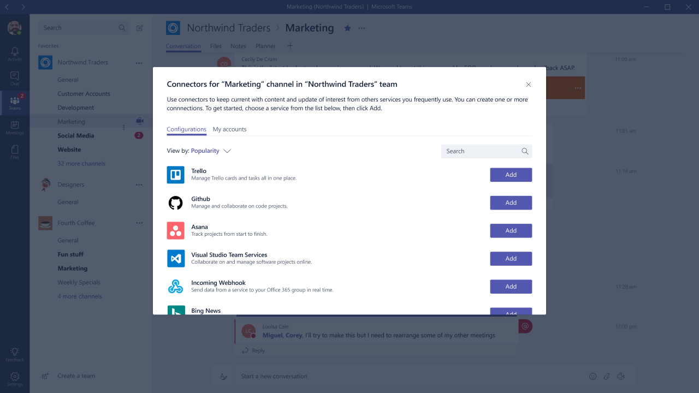

# Microsoft Teams developer preview

 Microsoft Teams is a chat-based workspace in Office 365 that integrates with apps and services that teams use to get work done together.  This developer preview makes it easy for you to integrate your own service, whether you develop custom apps for your enterprise or SaaS applications for teams around the world.

> **Don't have Microsoft Teams? Get a free one-year Office 365 developer subscription.** To get started developing for Microsoft Teams, you'll need an Office 365 account, and to turn on Microsoft Teams for your organization. [Here's how](setup.md).

## Tabs

Tabs are unique to Microsoft Teams.  They allow team members to access and act upon information from services directly within the Microsoft Teams experience. Examples of tabs include dashboards and data visualization, documents and notes, group task management and shared design canvases. Users can add tabs in either a chat or channel, and can have conversations about them. It's easy for you to create a tab app from your existing web app. 

[Get started with tabs](tabs.md)

## Bots

Build and connect intelligent bots to interact with Microsoft Teams users naturally through 1:1 chat. Bots can answer natural language questions and perform lightweight tasks such as querying bug information or kicking off a build.​ Any bot you've created using the [Microsoft Bot Framework](https://dev.botframework.com/) can easily be made to work in Microsoft Teams.

[Get started with bots](bots.md)

## Connectors

Office 365 Connectors are a great way to get useful information and content into Microsoft Teams. Any user can connect their group to services like Trello, Bing News, Twitter, etc., and get notified of the team's activity in that service. From tracking a team's progress in Trello, to following important hashtags in Twitter, Office 365 Connectors make it easier for teams to stay in sync and get more done.

You can build your own connectors through incoming webhooks to generate rich connector cards.

[Get started with connectors](connectors.md)

## Submit your questions, bugs, feature requests, and contributions

We listen to the developer community across a [several channels](feedback.md).

	
	

