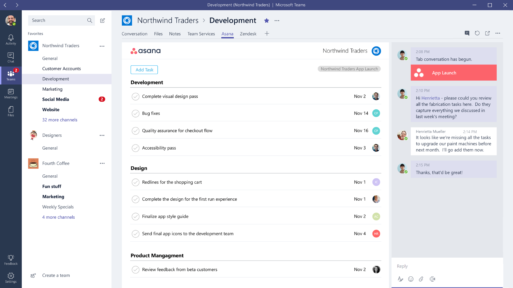
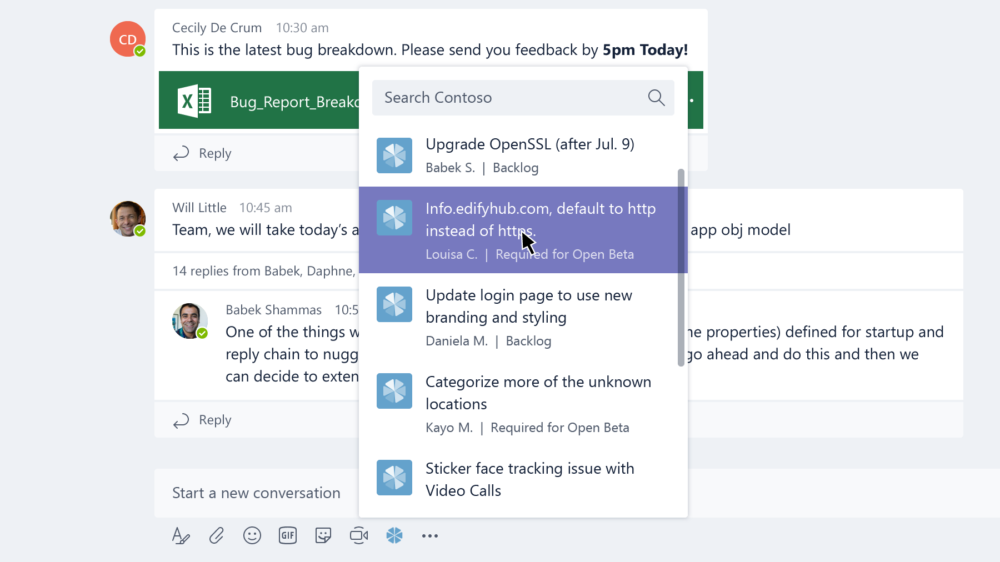

# Overview of Microsoft Teams Developer Platform

Microsoft Teams is a chat-based workspace in Office 365 that integrates with the apps and services teams use to get work done together.  The Microsoft Teams Developer platform makes it easy for you to integrate your own service, whether you develop custom apps for your enterprise or SaaS applications for teams around the world.

For the best and most extensible option for adding your service into Teams, create a Microsoft Teams app.  A Microsoft Teams app is a package of services that you host, that can be distributed through the Teams product or sideloaded by teams.

For quick one-off integration of your existing webhook, you can take advantage of our [Custom Bot](#custom-bots) feature.  This ad-hoc extensibility option allows you to simply set up webhooks / notifications in a specific team, with no additional coding required. 

> Don't have Microsoft Teams? Get a free Office 365 developer subscription or activate it for your existing Office 365 account. [Here's how](setup.md).

## Apps in Microsoft Teams

Apps in Microsoft Teams allow you to make your service available to users within Teams in contexts that make sense, all through one Teams App package that users can acquire through our in-product app gallery, via the Office Store, or sideloaded directly by your team.  Whether assisting in chat with a bot or compose extension, or creating a rich web view of the content channel members care about, Teams provides a single packaging option for you to create new or leverage existing functionality within the Teams experiences.

Here is a list of some the capabilities your experience can leverage today.

### Tabs

Tabs allow team members to access your service on a dedicated canvas, within a channel or in user's personal app space. You can leverage your existing web app to create a great tab experience within Teams.

Configurable tabs allow teams to work directly with the tools and data you provide, in the channel's context, and to have conversations about them. Examples of configurable tabs include dashboards and data visualization, documents and notes, group task management and shared design canvases.

Static tabs provide information for individual users, in their own dedicated app space.  Use these tabs to surface information catering to the individual such as personal task lists or dashboards, help content, or support information.

[Get started with tabs.](tabs.md)

### Bots

Build and connect intelligent bots to interact with Microsoft Teams users naturally through chat. Bots can answer natural language questions and perform lightweight tasks such as querying bug information or kicking off a build.​ Any bot you've created using the [Microsoft Bot Framework](https://dev.botframework.com/) can easily be made to work in Microsoft Teams.

While bots can take advantage of the rich natural language processing provided by the Bot Framework, your bot can also act as the command line interface of your experience.  Or you can choose to make a notification-only bot, to push information relevant to your users directly to them in a channel or direct message.

[Get started with bots.](bots.md)

### Compose Extensions

Leverage the power of your web service to provide a quick and easy way for your users to insert your content into the chat stream.

[Get started with compose extensions.](composeextensions.md)

### Connectors

Office 365 Connectors are a great way to get useful information and content into Microsoft Teams. Any user can connect their group to services like Trello, Bing News, Twitter, etc., and get notified of the team's activity in that service. From tracking a team's progress in Trello, to following important hashtags in Twitter, Office 365 Connectors make it easier for teams to stay in sync and get more done.

You can integrate your service by posting rich Connector cards into custom incoming webhooks.

[Get started with connectors.](connectors.md)

## Custom Bots

Custom bots provide a way for you to easily extend your team. You can easily get up and running with a bot that responds to messages within a team. You can use them for custom workflows and commands, such as kicking off a build or checking the latest set of livesite issues. Custom bots are an easy way of creating interactive bots without having to go through the full process of creating a bot via the Microsoft Bot Framework.  

[Get started with custom bots.](custombot.md)

## Submit your questions, bugs, feature requests, and contributions

We listen to the developer community across [several channels](feedback.md).

	
	

