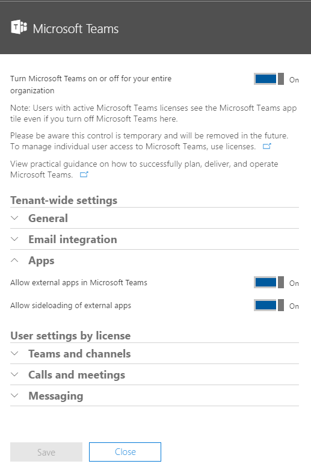

# Getting Started

Microsoft Teams is a service within Office 365. To get started developing extensions for Microsoft Teams, you'll first need an Office 365 commercial account. You'll then need to turn on the Microsoft Teams service for your Office 365 organization. Lastly, you'll need to turn on bots and enable sideloading of bots and tabs for testing.

## 1. Set up your Office 365 tenant

To develop apps for Microsoft Teams, you need to be an [Office 365 customer with one of the following plans](https://products.office.com/en-us/business/compare-more-office-365-for-business-plans). 

* Business Essentials
* Business Premium
* Enterprise E1, E3, and E5
* Developer
* Education, Education Plus, and Education E5

Microsoft Teams will also be available to customers who purchased E4 prior to its retirement.

If you don't currently have an Office 365 account, you can sign up for the [Office 365 Developer program](https://dev.office.com/devprogram) to get a FREE one-year Office 365 Developer Tenant.  This account should only be used for testing purposes.  See more information on [setting up your test accounts](https://support.office.com/en-us/article/Add-users-individually-or-in-bulk-to-Office-365-Admin-Help-1970f7d6-03b5-442f-b385-5880b9c256ec?ui=en-US&rs=en-US&ad=US).

## 2. Turn on Microsoft Teams for your organization

>See general information on [administrator settings](https://support.office.com/article/Administrator-settings-for-Microsoft-Teams-3966a3f5-7e0f-4ea9-a402-41888f455ba2) for Microsoft Teams.

The Office 365 Administrator might have to enable Microsoft Teams for your organization.  Note that all users must have a valid license assigned to access the product.  

1. [Sign in to Office 365](https://portal.office.com) with your administrator account.
2. Select **Admin** to go to the Office 365 Admin Center.
3. From **Settings**, select **Services & add-ins** or **Apps**.

	

4. From the list of services and add-ins, or apps, select **Microsoft Teams**.
 
	

5. On the **Microsoft Teams** settings screen, toggle Microsoft Teams **On** and then select **Save**.
 
	

## 3. Enable sideloading of apps for Microsoft Teams

To develop and test apps, you need to enable them in Microsoft Teams, and also enable sideloading of external apps.

>**Note:** For multi-SKU tenants, **all** SKUs must enable these settings.  If one SKU has not enabled this setting, the entire tenant is considered disabled. 

1. [Sign in to Office 365](https://portal.office.com) with your administrator account.
2. Select **Admin** to go to the Office 365 Admin Center.
3. From **Settings**, select  **Services & add-ins** or **Apps**.
4. From the list of services and add-ins, or apps, select **Microsoft Teams**.
5. On the **Microsoft Teams** settings screen, toggle both **Allow external apps in Microsoft Teams** and **Enable side loading of external apps** to **On**, and then select **Save**.

	

For more information on sideloading, see [Sideloading your app in a team](sideload.md).

## 4. Enable Public Developer Preview for your tenant (Optional) 

We'll be rolling out extensibility features for developers to try before they roll out to end users.  It's easy to opt-in or -out, on demand.  See [Public Developer Preview](publicpreview.md) for more information.

This is an optional feature and is not required for app development.

> Running into problems?  See the [troubleshooting guide](troubleshooting.md).