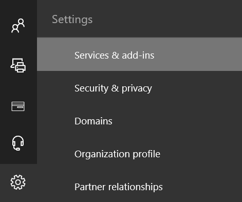

# Setting up Microsoft Teams (preview) for development

Microsoft Teams is a service within Office 365. To get started developing extensions for Microsoft Teams, you'll first need an Office 365 account. You'll then need to turn on the Microsoft Teams service for your Office 365 organization. Lastly, you'll need to turn on bots and enable side-loading of bots and tabs for testing.

## Sign up for a free Office 365 Developer subscription, or use an existing account

To develop extensions for Microsoft Teams, you need to be an [Office 365 commercial customer with one of the following plans](https://products.office.com/en-us/business/compare-more-office-365-for-business-plans). 

* Business Essentials
* Business Premium
* Enterprise E1, E3, and E5
* Developer

Microsoft Teams will also be available to customers who purchased E4 prior to its retirement.

If you don't currently have an Office 365 account, you can sign up for the [Office 365 Developer program](https://dev.office.com/devprogram) to get a FREE one-year subscription.  This test account will allow you to enable Teams for your group for testing purposes.  See [here](https://support.office.com/en-us/article/Add-users-individually-or-in-bulk-to-Office-365-Admin-Help-1970f7d6-03b5-442f-b385-5880b9c256ec?ui=en-US&rs=en-US&ad=US) for more information on assigning user licenses.
 
>**Note:** If the trial offer does not meet your needs, please contact [O365Dev@microsoft.com](mailto:O365Dev@microsoft.com) with more information about your company, your products and your interest in Microsoft Teams, or reach out directly to us at [Microsoft Teams developer support](mailto:microsoftteamsdev@microsoft.com) for help.

## Turn on Microsoft Teams for your organization

During the preview period, for Microsoft Teams to be available in Office 365 for your organization, someone with administrative rights in your organization must turn on the Microsoft Teams service. If you are working with an Office 365 Developer subscription, then by default you are an administrator of that organization.

Administrators need to use the Office 365 Admin Portal to enable Microsoft Teams for your organization.  Please note all users must have a valid license assigned to access the product.  

1. [Sign in to Office 365](https://login.microsoftonline.com) with your work or school account.
2. Select **Admin** to go to the Office 365 Admin Center.
3. From **Settings**, select **Services & add-ins** or **Apps**.

	

4. From the list of services and add-ins, or apps, select **Teams**.
 
	

5. On the **Teams** settings screen, toggle Microsoft Teams **On** and then select **Save**.
 
	

## Enable sideloading of bots and tabs

To develop and test bots and tabs, you need to enable bots in Microsoft Teams, and also enable bots and tabs to be side loaded.

>**Note:** For multi-sku tenants, **all** skus must enable these settings.  If one has not enabled, the entire tenant is considered disabled. 

1. [Sign in to Office 365](https://login.microsoftonline.com) with your work or school account.
2. Select **Admin** to go to the Office 365 Admin Center.
3. From **Settings**, select  **Services & add-ins** or **Apps**.
4. From the list of services and add-ins, or apps, select **Teams**.
5. On the **Teams** settings screen, toggle both **Enable bots in Teams** and **Enable side loading of external Bots** to **On**, and then select **Save**.

	

For more information on sideloading, see [Sideloading your bot or tab in a team](sideload.md).

## Next steps

* [Microsoft Teams developer preview](index.md)
